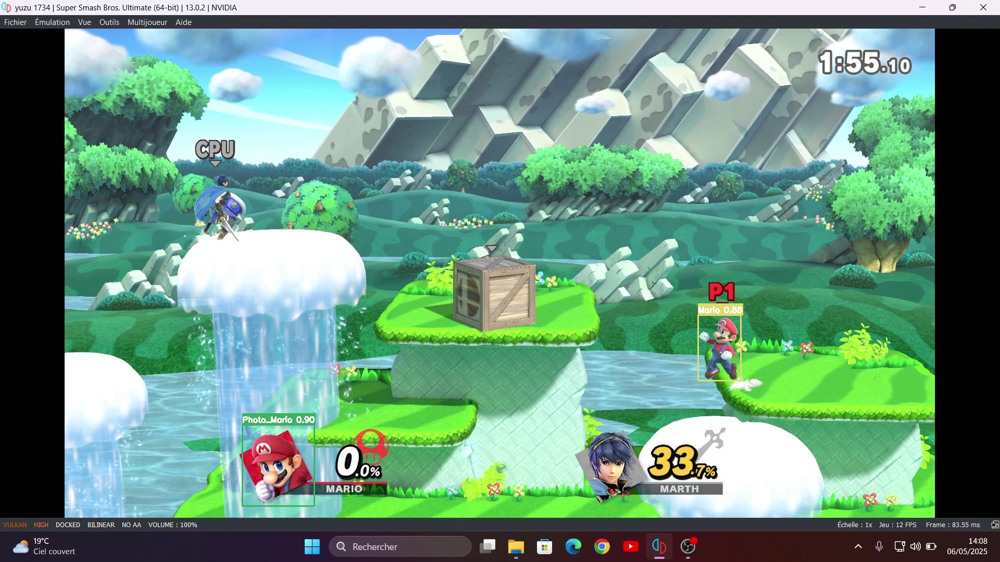

#  Look_mario 👀

## 📌 Description

Ce projet de **Computer Vision** utilise **YOLOv8** (You Only Look Once, version 8) pour détecter **Super Mario en tenue de base** dans des extraits de gameplay de **Super Smash Bros Ultimate**. L'objectif est de permettre une détection précise du personnage dans diverses scènes du jeu.

## 🧠 Technologies utilisées

- 🐍 **Python 3.0+**
- 🔍 **YOLOv8** (via [Ultralytics](https://github.com/ultralytics/ultralytics))
- 📦 **OpenCV**
- 🧰 **Label Studio**
- 🎞️ **Jupyter notebook** 

## 🎯 Objectifs

- Détecter uniquement **Super Mario avec sa tenue de base** dans les vidéos de gameplay.
- Entraîner (ou affiner) un modèle YOLOv8 sur un dataset personnalisé.
- Effectuer la détection en temps réel ou sur vidéos enregistrées.

## 📷 Screenshots

## 🗂️ Structure des données d'entraînement
Le dataset est organisé selon le format attendu par YOLOv8 et peut être crée par Label-Studio  :
<pre lang="markdown">
data/
├── images/
│   ├── train/
│   │   ├── mario1.jpg
│   │   └── ...
│   └── val/
│       ├── mario_val1.jpg
│       └── ...
├── labels/
│   ├── train/
│   │   ├── mario1.txt
│   │   └── ...
│   └── val/
│       ├── mario_val1.txt
│       └── ...
├── dataset.yaml
└── labels.txt

</pre>
 A vous de creer votre propre dataset si besoin

#### Le model pré original se trouve dans le dossier model sous l'extension .pt (best ou last)

